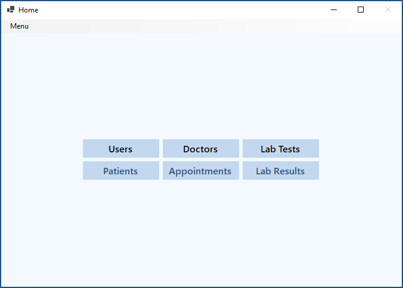
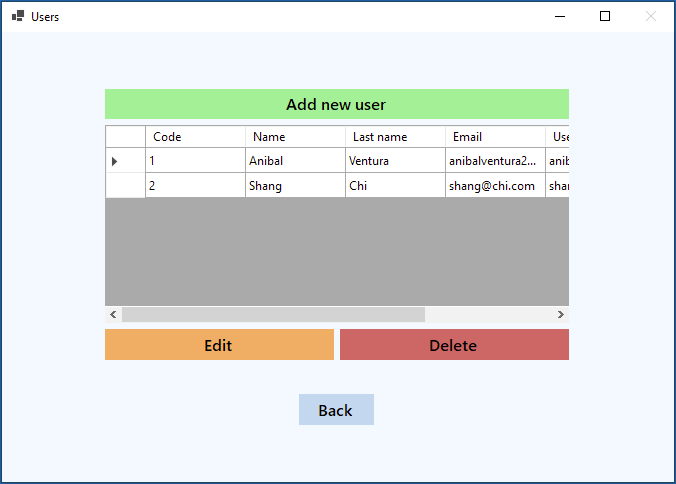
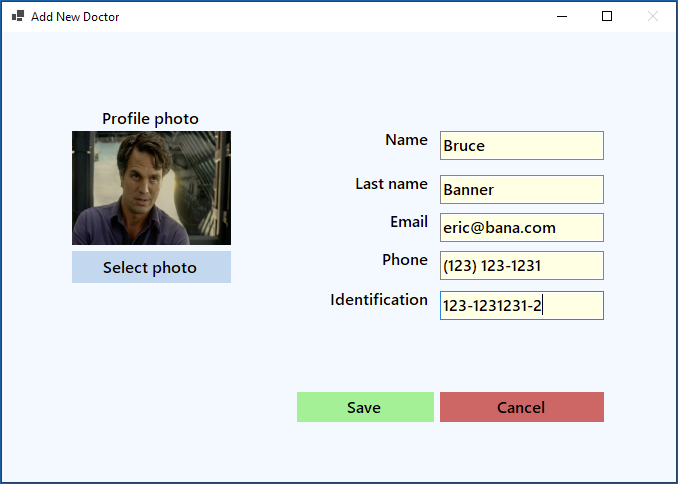
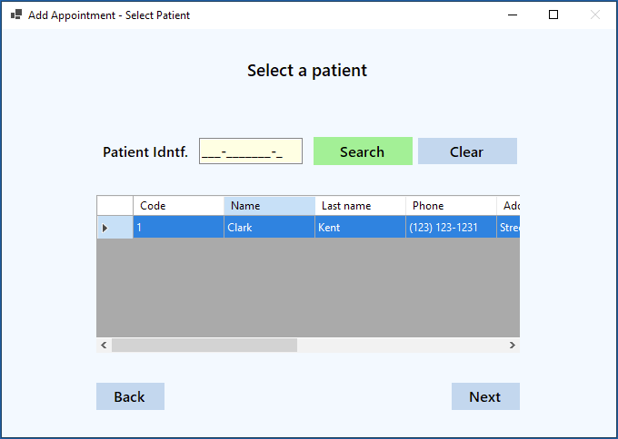
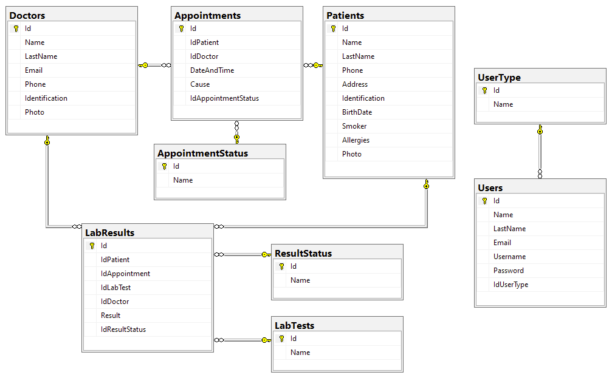

# Patient Management System

[](https://dotnet.microsoft.com)
[](https://dotnet.microsoft.com)
[](LICENCE.md)

<p align="center">
  
  
  
  
</p>

WinForm app to manage a patients system with lab results, written in .NET Core with SQL-Server using OOP.

## Features

- Data persistence with SQL Server.
- Login with username and password.
  - Verify in the database if the data entered is correct.
- Home with options depending of user type (Adm/Doctor).
  - Option in menu strip to logout user.
- Manage users to login (CRUD).
  - Send a email to the user when created.
- Manage doctors and patients (CRUD).
  - Can select a profile picture for both.
- Manage lab tests and results (CRUD).
- Manage appointments for patients (CRUD).
  - Wizard to select a patient, doctor and date.
  - Change state of the appointment.

## Database Diagram

<p align="left">
  
</p>

## Dependencies

- [System.Data.SqlClient - Version 4.8.3](https://www.nuget.org/packages/System.Data.SqlClient)
- [System.Configuration.ConfigurationManager - Version 6.0.0](https://www.nuget.org/packages/System.Configuration.ConfigurationManager/)

## Build

1. Open and run the following SQL script file `../Database/PatientMngmtSysDB.sql` to generate the database structure used in this project.

2. In the file `../ContactAgenda/App.config` find this line and change `source` parameter:

```xml
connectionString="data source=<SQL SERVER NAME>;initial catalog=ContactsAgenda;integrated security=True;"
```

3. On project layer `EmailHandler` open the file `EmailSettings.settings` and change values with your own SMTP Server configuration.

## License

```xml
MIT License

Copyright (c) 2021 Anibal Ventura
```
